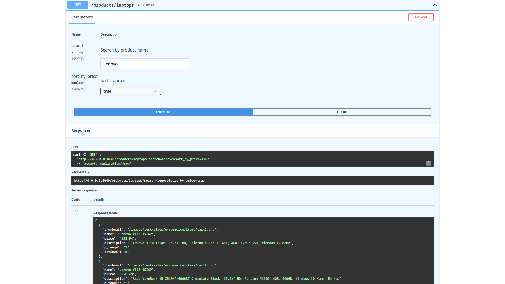
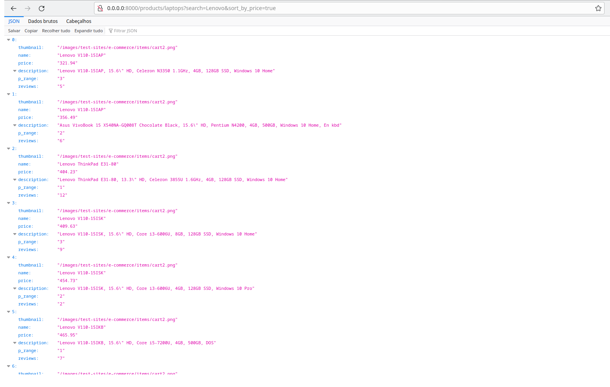

# DESAFIO IN8

Nesse desafio foi realizado a construção de um robô, que deve entrar no [site](https://webscraper.io/test-sites/e-commerce/allinone/computers/laptops) e pegar todos os notebooks Lenovo ordenando do mais barato para o mais caro. Pegar todos os dados disponíveis de cada produto.

É interessante que o robô possa ser consumido por outros serviços. Recomendamos a criação de uma pequena REST Ful API JSON para deixar mais otimizado.

```Utilizar Puppeteer ou Playwright (Node ou Python)```


Para isso a API foi construída com FastAPI, o método construído para realizar o desafio e:
```http://0.0.0.0:8000/products/laptops?search=Lenovo&sort_by_price=true```


A documentação completa da API pode ser acessada em:
```http://0.0.0.0:8000/docs```

Como bônus eu fiz o robô funcionar em todos as listas de produtos do [site](https://webscraper.io/test-sites/e-commerce/allinone/computers/laptops), por favor visualizar a documentação da API.

# Imagens




## Ferramentas utilizadas
- Poetry
- FastApi
- Playwright
- Uvicorn
- Docker

## Tutorial
### Com docker
- docker compose up -d ou docker-compose up -d
### Sem docker
- cd src
- poetry install
- poetry shell
- python main.py


# Contato

<a href="https://www.linkedin.com/in/talesmelquiades/"></img></a>

```
talesmelquiades@hotmail.com
```


